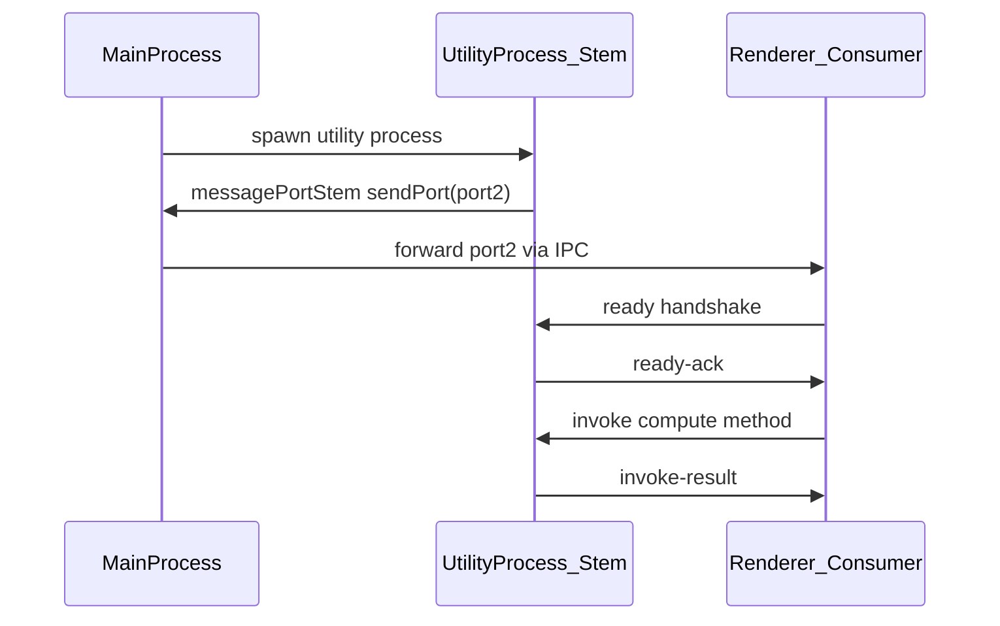

# Electron Port Forwarding

Arterial has no Electron dependency. The `messagePort` transport uses standard `MessageChannel` APIs, with `sendPort` / `getPort` callbacks that let your main process forward the port between processes.

This is the primary use case for stable cross-process RPC in Electron apps.

## Sequence



## Why Callbacks?

Electron's process model requires the main process to broker `MessagePort` transfers between utility processes and renderers. Arterial stays agnostic by never importing Electron APIs:

- **`sendPort`** — called by the stem when a `MessageChannel` is created; your code delivers `port2` to the consumer process (directly or via main-process IPC).
- **`getPort`** — called by the consumer during `connect()`; your code returns the port the main process forwarded.

```typescript
// Utility process (stem) — heavy compute, stays alive across UI reloads
const computeNode = createArterial({
  id: 'compute',
  venousId: 'app-v1',
  primaryDestinationId: 'renderer',
  transports: [
    messagePortStem({
      sendPort(port) {
        // Deliver port2 to main process for forwarding to renderer
        process.parentPort.postMessage({ type: 'arterial-port', port }, [port]);
      },
    }),
  ],
});

// Renderer (consumer) — UI thread, may reload
const uiNode = createArterial({
  id: 'renderer',
  venousId: 'app-v1',
  primaryDestinationId: 'compute',
  transports: [
    messagePortConsumer({
      getPort: () => window.electronAPI.getArterialPort(),
    }),
  ],
});
```

## Consumer Reload

When the renderer reloads, the utility process (stem) stays alive. The stem intercepts a new `ready` message and responds with `ready-ack` without creating a new channel:

```typescript
// Stem handles re-handshake on existing port (see messagePort.ts)
if (message.as === 'ready') {
  await sendMessage({ as: 'ready-ack', ... });
  return;
}
```

A new consumer instance reusing the same port can call `init()` again. See `resilience.test.ts` — `re-handshakes MessagePort when consumer reloads`.

## Optional WebSocket Backup

When the forwarded port is severed (process crash, channel close), add a WebSocket transport as backup:

```typescript
transports: [
  messagePortConsumer({ getPort: () => port }),  // primary — local, fast
  websocketConsumer({ url: 'ws://localhost:8080' }), // backup — network
]
```

Arterial tries transports in array order. If MessagePort fails, WebSocket carries the invoke automatically. See `failover.test.ts` and `docs/system-models.md` schematic B.

## Related Tests

| Scenario | Test |
|----------|------|
| Port handshake + RPC | `rpc.test.ts` (MessagePort parametrization) |
| Consumer reload | `resilience.test.ts` |
| Port severed, WS backup | `failover.test.ts` |
