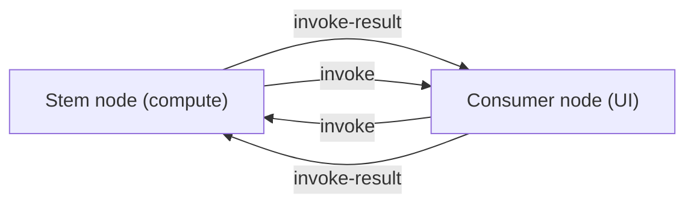
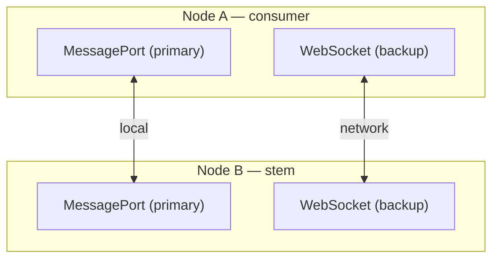
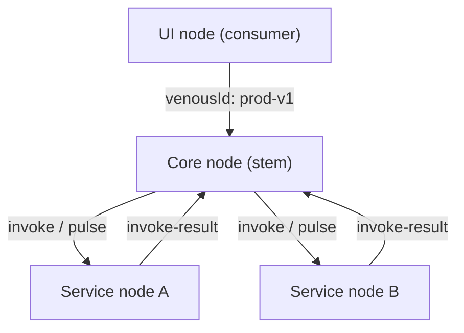

# System Models

Schematic patterns for modeling arterial systems. These describe topology and vocabulary — not API reference. See the [README](../README.md) for usage examples.

## Vocabulary

| Concept | Arterial field | Role |
|---------|----------------|------|
| Deployment boundary | `venousId` | Nodes in the same graph share one; different graphs ignore each other |
| Node identity | `id` | Unique per participant (core, service, UI) |
| Handshake target | `primaryDestinationId` | Default peer for initial `ready` / `ready-ack` |
| Exposed capability | `registerMethod` | Remote-callable function on a node |
| Heartbeat | `pulse` | Timestamp sent to a peer via all transports |
| Redundancy | `transports[]` | Priority-ordered list; first healthy transport wins |

---

## A. Two-Node RPC

The simplest graph: one stem, one consumer, shared `venousId`. After handshake, either side can invoke the other.



Both nodes share `venousId: 'sys-v1'`. The stem registers methods; the consumer invokes them. Bidirectional RPC works because both sides can `registerMethod` and `invoke`.

**Tests:** `rpc.test.ts` — initialization, invocation, bidirectional RPC.

---

## B. Dual-Transport Resilient Node

A node with local and remote arteries. Transports are tried in array order; unhealthy transports are skipped.



```typescript
// Consumer side — local first, network backup
transports: [
  messagePortConsumer({ getPort }),
  websocketConsumer({ url }),
]

// Stem side — mirrors the consumer
transports: [
  messagePortStem({ sendPort }),
  websocketStem({ wss }),
]
```

When the primary artery is severed, `sendToAvailableTransport` falls through to the backup. Replies route back through the transport that received the request.

**Tests:** `failover.test.ts` — closed port, closed socket, primary recovery.

**Docs:** [electron-port-forwarding.md](./electron-port-forwarding.md) for the MessagePort half of this pattern.

---

## C. Distributed Core + Services

A hub-and-spoke graph: a core node orchestrates multiple service nodes. A UI node connects to the core. All share one `venousId` per deployment.



### Mapping concepts

| System role | Arterial config |
|-------------|-----------------|
| Core orchestrator | `id: 'core'`, stem transports, registers dispatch methods |
| Service worker | `id: 'service-name'`, registers capability methods, `primaryDestinationId: 'core'` |
| UI / client | `id: 'ui'`, consumer transport, invokes core methods |
| Environment | `venousId: 'prod-v1'` on all nodes in the deployment |

### Heartbeat

The core sends `pulse` to each service on an interval. Services that stop responding are marked unhealthy via transport health hooks (`isHealthy`, `onDisconnect`). The core can skip unresponsive nodes when dispatching work.

### Isolation

Multiple deployments coexist by using different `venousId` values. Nodes on `prod-v1` never process messages from `staging-v1`, even if they share physical infrastructure.

**Tests:** `isolation.test.ts` — venous graph filtering on a shared wire.

---

## Choosing a Model

| Need | Model | Transports |
|------|-------|------------|
| Single app, two processes | A | `messagePort` |
| App + remote backend | A | `websocket` |
| Electron with network fallback | B | `messagePort` + `websocket` |
| Multi-service orchestration | C | `websocket` per service, or mixed |
